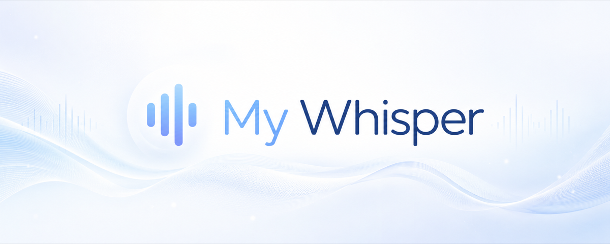
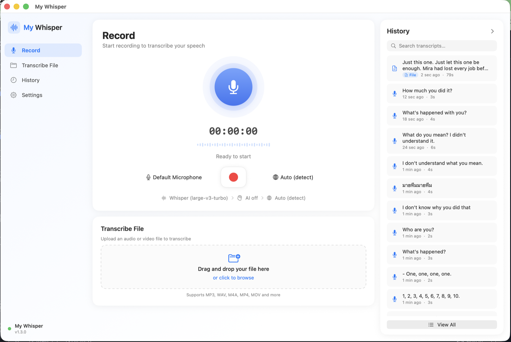

<div align="center">

<picture>
  <source media="(prefers-color-scheme: dark)" srcset="docs/banner_dark.png">
  
</picture>

### Private, local‑first dictation for macOS

Press a hotkey, speak, and your words are transcribed **on your Mac** and pasted into whatever you’re typing in — no cloud required.

[](#install)
[](#install)
[](#build-from-source)
[](https://github.com/badmintonAdmin/mywisper/releases/latest)
[](https://github.com/badmintonAdmin/mywisper/releases)
[](LICENSE)

[**Download**](#install) · [Features](#features) · [How it works](#how-it-works) · [Build from source](#build-from-source)

</div>

<p align="center">
  
</p>

---

## Why My Whisper

Most dictation tools send your voice to a server. **My Whisper runs Whisper locally** via a bundled, self‑contained [`whisper.cpp`](https://github.com/ggerganov/whisper.cpp) engine (GPU‑accelerated with Metal on Apple Silicon). Your audio never has to leave the machine. When you *want* more, you can opt into cloud transcription or AI clean‑up — but the default is private and offline.

It lives in your menu bar, fires on a global hotkey from **any** app, and pastes the result straight into the focused text field.

## Features

- 🎙️ **Global‑hotkey dictation** — press **⌥Space** (or double‑tap **Fn**) anywhere; speak; the text is pasted into the focused field. Fully customizable shortcut.
- 🔒 **Local‑first & private** — transcribe on‑device with bundled `whisper.cpp`. No account, no network needed.
- 🧠 **Three engines** — local **Whisper** (private), **Apple Speech** (fast, on‑device), or **Cloud Whisper** (OpenAI API, top quality). Pick per your needs.
- ⚡ **Tuned for Apple Silicon** — Metal + flash‑attention, performance‑core threading, and a `large‑v3‑turbo` model option for near‑large quality at a fraction of the latency.
- ✨ **AI post‑processing (optional)** — clean up, reformat, translate, or restyle your dictation with OpenAI models, including the latest **GPT‑5 family** (default stays the cheap‑and‑plenty `gpt‑4o‑mini`).
- 📄 **Transcribe files** — drag in audio or video (MP3, WAV, M4A, MP4, MOV…) and get a transcript; saved to history with a **File** tag.
- 🗂️ **History** — searchable log of everything you’ve transcribed, with one‑click copy.
- 🌍 **14 languages + auto‑detect** — English, Russian, Spanish, French, German, and more.
- 📖 **Custom dictionary & vocabulary** — teach it your names, jargon, and replacements.
- 🔊 **Sound library** — pick your start/finish cue, with a dedicated error sound.
- 🧩 **Native menu‑bar app** — `LSUIElement`, launch‑at‑login, optional Dock icon.

## Install

> **Apple Silicon (M1–M4)** is the recommended, fully‑tested build. The Intel build is experimental (cross‑built, not hardware‑tested).

1. Download the DMG for your Mac from the [**latest release**](https://github.com/badmintonAdmin/mywisper/releases/latest):
   - **Apple Silicon** → `mywisper-x.y.z-AppleSilicon.dmg`
   - **Intel** → `mywisper-x.y.z-Intel.dmg` *(experimental)*
2. Open the DMG and drag **My Whisper** into **Applications**.
3. Launch it. On first run, open **Settings → Permissions** and grant **Accessibility** (needed to paste into other apps) and **Microphone**.

<details>
<summary><b>“My Whisper is damaged / can’t be opened”?</b></summary>

The app is ad‑hoc signed (not notarized), so Gatekeeper warns on first open. Either:

- **Right‑click** the app → **Open** → **Open**, or
- run once in Terminal:
  ```bash
  xattr -dr com.apple.quarantine /Applications/mywisper.app
  ```
</details>

## How it works

```
Hotkey (⌥Space / double‑tap Fn) → DictationManager (orchestrator)
  ├── AudioRecorder (AVAudioEngine)         → mic capture + 16 kHz mono
  ├── WhisperTranscriber (whisper.cpp CLI)  → local transcription (Metal)
  ├── SpeechTranscriber (SFSpeechRecognizer)→ on‑device alternative
  ├── Cloud / OpenAIService                 → cloud STT + AI post‑processing
  ├── RecordingOverlay (floating panel)     → visual feedback
  └── TextPaster (NSPasteboard + ⌘V)        → paste into the focused field
```

Record → stop → convert to 16 kHz mono → transcribe the full clip with Whisper → (optionally refine with AI) → paste. Whisper isn’t streaming: it processes the complete recording after you stop.

## Transcription engines

| Engine | Privacy | Speed | Quality | Needs |
|---|---|---|---|---|
| **Local Whisper** (default) | 🟢 fully on‑device | Fast on Apple Silicon (Metal) | High (model‑dependent) | One‑time model download |
| **Apple Speech** | 🟢 on‑device | Very fast | Good | — |
| **Cloud Whisper** | 🟡 sent to OpenAI | Fast | Top | OpenAI API key |

Whisper models from **Tiny (75 MB)** to **Large‑v3 / Large‑v3‑turbo** are downloadable in‑app.

## Privacy

- Local Whisper and Apple Speech never send audio off the device.
- Cloud transcription and AI post‑processing are **opt‑in** and only used when you enable them and provide an OpenAI key.
- History is stored locally in `~/Library/Application Support/mywisper/`.

## Build from source

Requires full **Xcode** (Metal + `xcodebuild`).

```bash
# Resolve dependencies, then build & run
xcodebuild -project mywisper.xcodeproj -scheme mywisper -resolvePackageDependencies
xcodebuild -project mywisper.xcodeproj -scheme mywisper build
```

Package a distributable DMG (builds a self‑contained `whisper.cpp` and bundles it into the app):

```bash
# Apple Silicon (arm64, Metal)
bash scripts/create_dmg.sh
# Intel (x86_64, CPU)
ARCH=x86_64 bash scripts/create_dmg.sh
```

The DMG lands in `installation/Silicon/` or `installation/Intel/`.

## Tech

Swift 5 · SwiftUI + AppKit · `MenuBarExtra` · whisper.cpp (Metal) · `SFSpeechRecognizer` · OpenAI API · macOS 13.3+. App sandbox is disabled (required for synthetic ⌘V paste via `CGEvent`).

## License

[MIT](LICENSE) © barssoft
